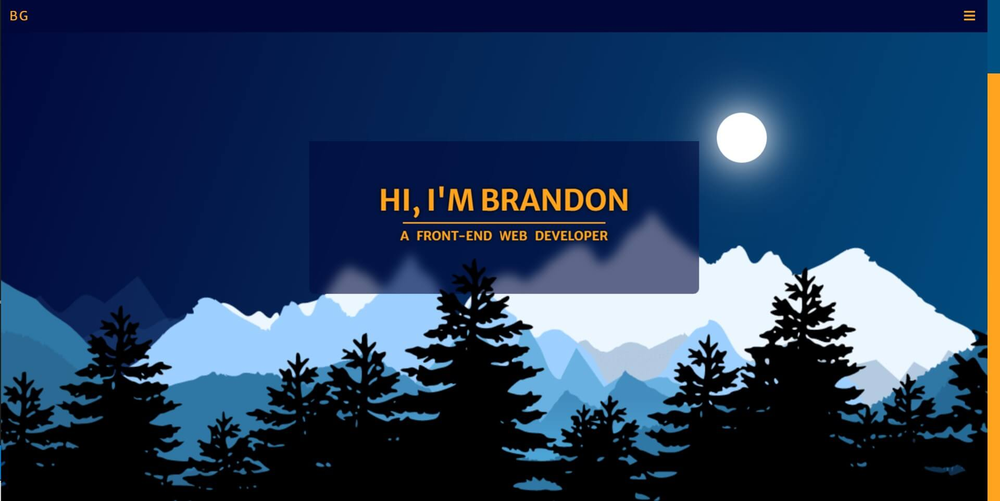

# Brandon's Frontend Portfolio

### Screenshot



Hello and welcome! My name is Brandon and I am a front-end web developer.

## Table of contents

- [Overview](#overview)
  - [Screenshot](#screenshot)
  - [Links](#links)
- [My process](#my-process)
  - [Built with](#built-with)
  - [What I learned](#what-i-learned)
- [Author](#author)
  )

## Overview

A portfolio site providing project examples, skills, resume, and contact form. Parallax backgrounds, Intersection Observers, custom animation effects, custom SVG backgrounds, event listeners, and more used throughout.

### Links

- Live Site URL: [https://guthribm.github.io/cv/](https://guthribm.github.io/cv/)

## My process

### Built with

- Semantic HTML5 markup
- CSS custom properties
- Fully Responsive Design
- Flexbox
- CSS Grid
- Mobile-first workflow
- JQuery

### What I learned

A neat hover/click effect for the menu buttons that fill in the background color using "box-shadow: inset" property and translateY
👇

```css
.menu-link {
  color: var(--dark-blue);
  font-family: var(--font);
  font-size: 1.5rem;
  display: block;
  padding: 0.5rem;
  margin: 0.5rem auto;
  transition: ease-in 0.35s;
}

.menu-link:hover,
.menu-link:active,
.menu-link:focus {
  box-shadow: inset -80rem 0 0 0 var(--med-blue), -5px 9px 3px rgba(0, 8, 57, 0.5);
  border-color: var(--med-blue);
  color: #fff;
  transform: translateY(-3px);
}
```

MORE IMPORTANTLY, I learned that cool animations are useless if you don't set a setTimeout function long enough to for the animation to play and see it! 🤣

## Author

- LinkedIn - [@guthribm](https://www.linkedin.com/in/guthribm/)
